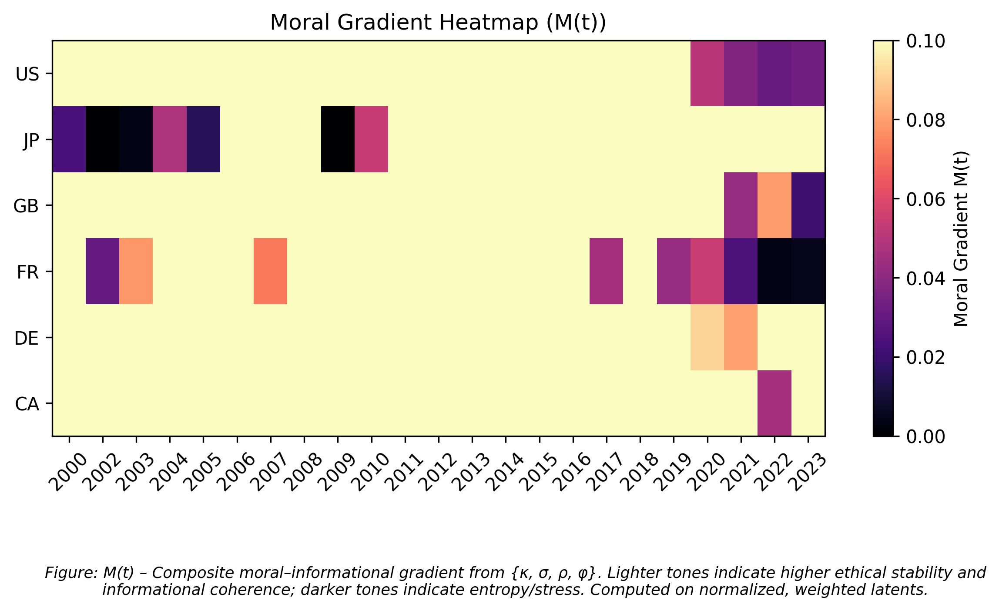

# Ontology of the Simulated Universe — Repo Scaffold (v0.8)
**The Ontology of the Simulated Universe — Formalization & Empirical Framework**

This repository implements the **moral-informational gradient** framework *M(t)* proposed in  
Hickerson, J. (2025). *Ontology of the Simulated Universe (v0.8): Entangled Moral-Informational Fields.*  
[DOI:10.5281/zenodo.17352751](https://doi.org/10.5281/zenodo.17352751)

The code provides a computational pipeline to operationalize the theory’s latent variables —  
κ (coherence), σ (suffering entropy), ρ (resilience), and φ (pluralism) — and compute the moral gradient M(t)  
using open-source socio-economic and ethical proxies.

---

---

### 🧭 Project Run Summary
| ETL | Model | Visualization | Quantum Layer |
|:---:|:------:|:---------------:|:---------------:|
| ✅ | ✅ | ✅ | 🔜 (v0.9 planned) |

> *Status badges summarize operational readiness of each module.*

---

### 🖼️ Latest Figure Previews
| Moral Gradient Heatmap | Simulation: Refinement | Simulation: Multi-Generational |
|:----------------------:|:----------------------:|:-------------------------------:|
|  |  |  |

> Figures auto-update when re-run; captions and interpretive notes are saved in `results/figures/*.txt`.

---

## 📑 Conceptual Summary

| Symbol | Concept | Direction | Description |
|:------:|:---------|:-----------|:-------------|
| **κ (Kappa)** | Cooperative Coherence | ↑ Positive | Measures institutional or systemic alignment and efficiency. |
| **σ (Sigma)** | Moral Entropy / Suffering Load | ↓ Negative | Represents disorder, inequality, and instability in moral systems. |
| **ρ (Rho)** | Structural Regularity | ↑ Positive | Captures lawful consistency and resilience of ethical structures. |
| **φ (Phi)** | Pluralism / Adaptive Diversity | ↑ Positive | Captures inclusivity and adaptive flexibility in ethical systems. |
| **M(t)** | Moral-Informational Gradient | — | Composite index of ethical equilibrium over time. |

The moral gradient is computed as:

\[
M(t) = \frac{κ(t)}{σ(t) + ε} \times ρ(t) \times φ(t)
\]

where \( ε \) is a small regularization constant to avoid division instability.

---

## 🧩 Repository Structure

OSIU_repo_scaffold/
├── configs/
│ └── indicators.yaml # Proxy definitions and weights
├── src/
│ ├── etl/
│ │ ├── fetch_all.py # Master data fetcher (World Bank, UCDP, etc.)
│ │ ├── fetch_worldbank.py # Example API loader
│ │ └── validate_schema.py # Consistency checks
│ ├── model/
│ │ ├── fit_latents.py # Normalization + latent construction
│ │ ├── compute_M.py # Computes M(t) and writes processed data
│ └── viz/
│ └── plots.py # Generates time-series + heatmap with captions
├── data/
│ ├── raw/ # Downloaded or stub data
│ ├── interim/ # Normalized indicators
│ └── processed/ # Latents + M(t)
└── results/
└── figures/ # Figures + textual captions


---

## ⚙️ Installation

### 1. Clone the repository

```bash
git clone https://github.com/joshdotexe/Quantum-Entangled-Ontology-The-Ontology-of-the-Simulated-Universe-v0.5-2025-.git
cd Quantum-Entangled-Ontology-v0.8

Windows (Powershell)
python -m venv .venv
.venv\Scripts\activate
pip install -r requirements.txt

Linux / macOS
python3 -m venv .venv
source .venv/bin/activate
pip install -r requirements.txt

Running the Full Pipeline
1. Fetch and normalize data
python -m src.etl.fetch_all --config configs\indicators.yaml
python -m src.etl.validate_schema

2. Build latents and compute M(t)
python -m src.model.fit_latents --config configs\indicators.yaml
python -m src.model.compute_M --config configs\indicators.yaml

3. Generate figures
python -c "from src.viz.plots import plot_timeseries, plot_M_heatmap; \
plot_timeseries('data/processed/latents.csv'); \
plot_M_heatmap('data/processed/M_timeseries.csv')"


Figures and captions are written to:

results/figures/

📊 Outputs
Time-Series Plots (latents_timeseries_*.png)

Each plot includes:

κ (Kappa) – Governance / coherence over time

σ (Sigma) – Moral entropy (inverse indicator)

ρ (Rho) – Regularity and resilience

φ (Phi) – Pluralism and adaptive diversity

Each figure is accompanied by a .txt file explaining theoretical interpretation.

Heatmap (M_heatmap.png)

Displays M(t) across regions × years.

Color	Meaning
Bright / Light	High moral coherence and stability (theory supported)
Dark / Uneven	Instability, entropy, or incomplete coupling
Theory Guide

results/figures/theory_expectations.txt
Outlines what you should expect to see if the model is supported empirically:

A smooth upward-bright gradient in M(t) indicates convergence toward moral equilibrium.
Flat or chaotic gradients suggest incomplete proxy normalization or ethical-structural misalignment.

🧠 Validation Expectations (Summary)
Variable	Expected Empirical Pattern	Interpretation
κ	↑ Stable or increasing	Strong coherence and institutional order
σ	↓ Declining	Less systemic suffering or disorder
ρ	↑ Tracking κ	Structural alignment with moral coherence
φ	↗ Mild oscillations	Healthy pluralism
M(t)	Smooth brightening	Ethical equilibrium emerging
🧪 Data Sources
Proxy	Description
World Bank Governance Indicators	Government Effectiveness, Rule of Law
UCDP / PRIO Conflict Data	Conflict frequency and intensity
World Happiness Report	Subjective well-being (inverted for σ)
Inequality and Diversity Indices	Socio-economic disparity and cultural heterogeneity

Custom or local data can be added by editing configs/indicators.yaml.

### Simulation: Refinement Under Improving Measurement Quality

We include a simple simulation that demonstrates a **theory-consistent signature**:
as measurement quality improves, the system’s **suffering load** σ(t) tends to decline,
**coherence** κ(t) tends to rise, and the **moral gradient** M(t) increases.

**Run:**
```bash
python -m src.model.sim_refinement

### Simulation: Multi-Generational Seeding (Utopia vs. Balanced)

**File:** `src/model/sim_multigenerational.py`  
**Run:** `python -m src.model.sim_multigenerational`

This simulation compares three lines:
- **Utopian child (red):** Seeded with near-zero σ. Lacks adversity gradient → ρ and φ decay → **M(t) stagnates**.
- **Balanced child (green):** Seeded with slight σ > 0. Preserves gradient → **M(t) stabilizes or grows**.
- **Grandchild (blue):** Spawns from balanced child’s terminal state with slight σ → **further refinement**.

**Interpretation:** If the ontology is correct, perfectly utopian seeds should underperform (stagnate) compared to slightly adverse seeds that maintain a moral gradient. The “loop viability” requires non-zero σ at seeding to sustain adaptation across generations.


🧭 Interpretation Philosophy

The theory expects coherence (κ) and resilience (ρ) to rise as entropy (σ) declines, with pluralism (φ) stabilizing moral equilibrium. M(t) thus acts as a global measure of ethical convergence under informational constraints.

🧩 Folder Outputs Overview
Folder	Purpose
data/raw	Raw API pulls or CSV stubs
data/interim	Normalized indicators
data/processed	Latent variables + M(t)
results/figures	Graphs and captions
results/figures/theory_expectations.txt	Global interpretive guide
🧠 Reproducibility & Citation

To cite this framework:

Hickerson, J. (2025). Ontology of the Simulated Universe v0.8: 
Entangled Moral-Informational Fields. Zenodo. https://doi.org/10.5281/zenodo.17352751

🤝 Contributing

Pull requests are welcome for:

Additional ethical or empirical proxies

Improved data normalization or weighting functions

Quantum-normative simulation modules (/models planned for v0.9)

Please cite the Zenodo DOI above in derivative work.

📜 License

MIT License © 2025 Joshua Hickerson
For academic and non-commercial research use.

🌐 Contact

For collaboration or correspondence:
📧 joshdotexe@gmail.com


⚛️ Summary

This repository serves as the empirical bridge between theoretical moral ontology and measurable world data.
If the model is supported, M(t) should reveal increasing coherence and entropy minimization—an early, testable signature of moral self-organization in complex systems.